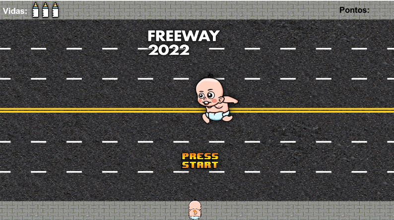

# Freeway 2022

**Freeway 2022** is the remake of the game Freeway originally released for the Atari video game in 1981.
The idea of this project was to recreate the original game with an updated interface, and add Artificial Intelligence, through the `Reinforcement Learning` technique to train a game agent to perform a certain task. In our case, crossing the highway dodging all vehicles.

## AI training

The initial goal was to recreate the original game, using the Unity game engine I recreated the game layout and the simulation of car traffic on a highway.
At that moment I wasn't worried about the interface yet, so I used polygons to simulate the game objects

That done, now my main concern would be to use this created scenario to train the game's agent to cross the street. Unity has a library called [ML-Agents](https://github.com/Unity-Technologies/ml-agents) which gives you many tools for training an agent in a game, using this library I was able to start the first AI trainings.

During the first trainings, the agent's learning was being influenced by the traffic (As it should be), however the game's traffic was predictable, the cars were following a constant rhythm and were instantiated always in the same way, this made the AI to learn a pattern and not learn to dodge cars regardless of the situation.

From this analysis it was necessary to change the way traffic on the highway behaved, making the highway completely random, so our AI would need to learn to cross completely chaotic traffic.

The last, and essential, step for the AI to be able to dodge vehicles very successfully was to add proximity sensors to the agent during its training. In this way, the agent can predict the approach of various obstacles and anticipate and plan an action.

Finally, we have our artificial intelligence trained and crossing the street!

